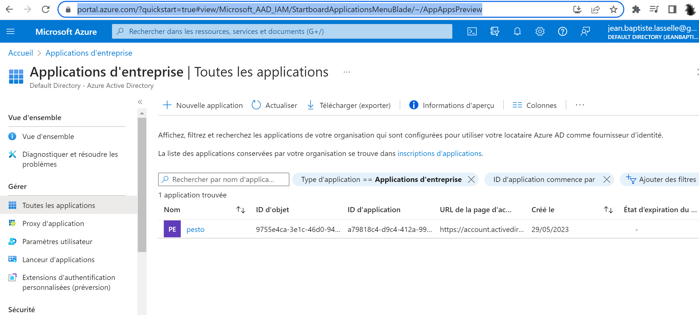

## The Azure AD Token authentication flow

### Create the Azure AD Application

(In french "Application d'entrprise")


I created the Azue AD Application at https://portal.azure.com/?quickstart=true#view/Microsoft_AAD_IAM/StartboardApplicationsMenuBlade/~/AppAppsPreview

I get a client ID, from which i can create as many client secrets i want, using the Azure CLI, and (The Azure API to add a service principla to )





### Create the client secret using the Azure CLI


```bash
export AZURE_AD_APP_RESOURCE_GRP_NAME=""
export AZURE_AD_APP_RESOURCE_GRP_ID=""
export AZURE_AD_APP_RESOURCE_SUBSCRIPTION_ID=""


```


### Create the Azure AD Token / refresh Token

* The `Azure AD Token` expires after one hour, by default
* We can resquest a new `Azure AD Token`, using a refresh token : 
  * 

```bash
export AZ_AD_APP_TENANT_ID=""
export AZ_AD_APP_CLIENT_ID=""
export AZ_AD_APP_CLIENT_SECRET=""
export AZ_AD_TOKEN_SCOPE="2ff814a6-3304-4ab8-85cb-cd0e6f879c1d%2F.default"

curl -X POST -H 'Content-Type: application/x-www-form-urlencoded' \
https://login.microsoftonline.com/<tenant-id>/oauth2/v2.0/token \
-d "client_secret=${AZ_AD_APP_CLIENT_ID}" \
-d 'grant_type=client_credentials' \
-d "scope=${AZ_AD_TOKEN_SCOPE}" \ 
-d "client_secret=${AZ_AD_APP_CLIENT_SECRET}"
```

Where : 
* **_Tenant Id_** with the registered application’s tenant ID.
* **_Client Id_** with the registered application’s client ID.
* **_Client Secret_** with the registered application’s client secret value.


## ANNEX : References

Tous les liens de référence que j'ai consulté sur le sujet : 
* https://portal.azure.com/?quickstart=true#view/Microsoft_Azure_Resources/QuickstartCenterBlade
* https://learn.microsoft.com/fr-fr/azure/devops/integrate/get-started/authentication/service-principal-managed-identity?wt.md_id=searchAPI_azureportal_inproduct_rmskilling&sessionId=adebcc4ce1ca4af2848f942dce5e246b&view=azure-devops#create-an-application-service-principal
* https://github.com/microsoft/azure-devops-auth-samples/tree/master/ServicePrincipalsSamples/ClientLibsNET
* https://learn.microsoft.com/fr-fr/azure/devops/integrate/get-started/authentication/service-principal-managed-identity?wt.md_id=searchAPI_azureportal_inproduct_rmskilling&sessionId=5bfc40131b8340e09843aed6f846b8bd&view=azure-devops#q-why-should-i-use-a-service-principal-or-a-managed-identity-instead-of-a-pat
* https://learn.microsoft.com/en-us/azure/databricks/dev-tools/api/latest/aad/service-prin-aad-token#--api-access-for-service-principals-that-are-azure-databricks-users-and-admins
* https://learn.microsoft.com/en-us/azure/databricks/dev-tools/api/latest/aad/service-prin-aad-token#--workspace-level-api-access-for-service-principals-that-are-not-azure-databricks-users
* https://learn.microsoft.com/en-us/azure/active-directory/manage-apps/view-applications-portal
* autre exemple d'intégration avec Service Principals, mais cette fois Azure Devops au lieu de Databricks : https://learn.microsoft.com/fr-fr/azure/devops/integrate/get-started/authentication/service-principal-managed-identity?wt.md_id=searchAPI_azureportal_inproduct_rmskilling&sessionId=adebcc4ce1ca4af2848f942dce5e246b&view=azure-devops

* https://www.google.com/search?q=azure+cli+create+azure+ad+token+from+service+principals&source=hp&ei=wvB0ZICuBr6ZkdUPssqo4Ak&iflsig=AOEireoAAAAAZHT-0nYAMq5o_vsodvN9vBd7cEU-fFt5&ved=0ahUKEwiAl7f1lZv_AhW-TKQEHTIlCpwQ4dUDCAk&uact=5&oq=azure+cli+create+azure+ad+token+from+service+principals&gs_lcp=Cgdnd3Mtd2l6EAMyBwghEKABEAo6CwguEIAEEMcBENEDOgUIABCABDoFCC4QgAQ6CwguEIAEEMcBEK8BOggILhCABBDUAjoHCAAQDRCABDoGCAAQFhAeOggIABCKBRCGAzoFCCEQoAE6BAghEBU6CAghEBYQHhAdUABY37MBYOm2AWgQcAB4AYABoAKIAfhIkgEHNy40OS4xMJgBAKABAQ&sclient=gws-wiz

